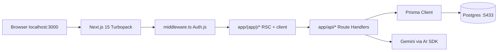
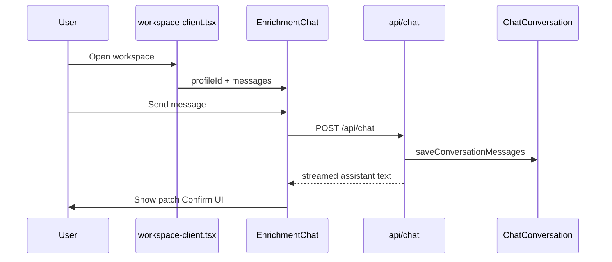

# 01 — Basics & architecture

You cloned **rirekisho!** — an AI resume builder where chat proposes changes, you confirm them, and a live A4 preview stays in sync. This chapter puts three ideas in your head before you open files: **ownership**, **master vs presentation**, and **confirm-before-write**. Then we walk the repo layout and what physically happens when `npm run dev` runs.

## What this product is

From [README.md](../README.md): GitHub sign-in → optional LinkedIn import → enrichment chat with patches → Classic/Modern A4 preview → EN source plus JA/FR locales → browser print / Word / share links. Job applications and cover letters hang off the same stack (see chapter 4).

The npm package name is `rirekisho` (no bang) — GitHub and Vercel cannot use `!` in slugs. Product marketing says **rirekisho!**; code and URLs say `rirekisho`.

## Three concepts (memorize these)

1. **Ownership** — Almost every Prisma query is scoped by `session.user.id`. If a row is not yours, APIs return 404/403, not someone else’s data.
2. **Master resume vs locale presentation** — `MasterResumeProfile.data` is the canonical JSON (usually English). Translations live in `LocalePresentation` rows and **never overwrite** the master. The Prisma comment says so explicitly in [prisma/schema.prisma](../prisma/schema.prisma).
3. **Confirm-before-write** — The LLM may *propose* a patch with provenance `ai_suggested`. Nothing lands in the master until the UI calls `PATCH /api/profile` with `confirmAiSuggestions: true` ([components/chat/patch-confirm.tsx](../components/chat/patch-confirm.tsx)).

| Approach | What this repo does | When you’d pick the other |
|----------|---------------------|---------------------------|
| Auto-apply AI edits | Rejected — user confirms | Chatbot toys with throwaway drafts |
| Single JSON blob for all languages | Master + `LocalePresentation` | Tiny apps with one locale forever |
| Cookie DB sessions only | JWT sessions + Prisma adapter | Classic cookie stores in Postgres |

## Repo layout (the map)

```text
app/                  App Router: marketing, (app) shell, public shares, api/
components/           React UI: chat, preview, export, applications, ui/
lib/                  Domain logic: auth, ai, resume, etl, applications, cover-letter
templates/            classic/ + modern/ preview + react-pdf documents
prisma/               schema + migrations
tests/unit/           Vitest — pure functions, no browser
specs/                Spec Kit product docs (002 resume, 003 apps, 004 cover letter)
```

Path alias `@/` → repo root ([vitest.config.ts](../vitest.config.ts), same as Next).

## What happens when the app runs



Caption: middleware only guards app paths; marketing `/` and public `/r/[token]` stay open.

**Dev bootstrap** (from README — do this once):

1. Node **20+** and npm.
2. `docker compose up -d` — Postgres on port **5433** (not 5432).
3. `cp .env.example .env.local` and fill `DATABASE_URL`, `AUTH_*`, `GOOGLE_GENERATIVE_AI_API_KEY`.
4. `npm install` (runs `prisma generate` via `postinstall`).
5. `npx prisma migrate deploy`
6. `npm run dev` → Turbopack on [http://localhost:3000](http://localhost:3000)

Without `GOOGLE_GENERATIVE_AI_API_KEY`, chat/translate still run in **offline/demo** modes (`hasLlmKey()` in [lib/ai/models.ts](../lib/ai/models.ts)) so the UI does not hard-crash.

## Auth at the edge vs in the layout

[middleware.ts](../middleware.ts) wraps Auth.js and matches only onboarding, applications, resumes, workspace, sharing, and settings. [lib/auth.config.ts](../lib/auth.config.ts) uses GitHub with **sign-in scopes only** (`read:user user:email`) — no repo import. Sessions are **JWT**; `session.user.id` is copied from the token `sub` so Prisma ownership checks have a stable user id.

[app/(app)/layout.tsx](../app/(app)/layout.tsx) calls `auth()` again and redirects to `/` if missing — belt and suspenders with middleware.

## Where “production” starts for a resume edit

1. `/resumes` → pick or create a `MasterResumeProfile`.
2. `/workspace/[profileId]` loads chat + preview.
3. Chat POSTs [app/api/chat/route.ts](../app/api/chat/route.ts); confirmed patches hit profile merge (chapters 2–3).
4. Export uses print CSS or `docx`.



Caption: streaming and persistence are server-side; Confirm is a separate `PATCH /api/profile` call.

Next we open the **master resume JSON** itself — the Zod schema, provenance rules, and merge logic that make “confirm AI” safe.

## Try it out

Try each step yourself first — expand the solution only when stuck.

1. Start Postgres and confirm `prisma migrate deploy` succeeds against the Compose DB.

   <details>
   <summary><b>Solution</b></summary>

   ```bash
   docker compose up -d
   # DATABASE_URL in .env.local must use port 5433 — see README / docker-compose.yml
   npx prisma migrate deploy
   ```

   Success looks like “All migrations have been successfully applied” (or already applied). This is the same migrate step `npm run build` runs on Vercel.
   </details>

2. Read [lib/ai/models.ts](../lib/ai/models.ts) and list every caller of `hasLlmKey` you can find with ripgrep.

   <details>
   <summary><b>Solution</b></summary>

   ```bash
   rg "hasLlmKey" -g '*.ts' -g '*.tsx'
   ```

   You should hit chat routes, translate, LinkedIn extract, job posting parse, cover-letter chat. Offline fallbacks are intentional product behavior, not an afterthought.
   </details>

3. Curl workspace without cookies and confirm you do not get a 200 HTML app shell.

   <details>
   <summary><b>Solution</b></summary>

   ```bash
   curl -sI http://localhost:3000/workspace | head -20
   ```

   Expect a redirect toward `/` (sign-in). Ownership starts before React renders.
   </details>

4. Skim `MasterResumeProfile` in [prisma/schema.prisma](../prisma/schema.prisma) and name the relations for chat, translations, and shares.

   <details>
   <summary><b>Solution</b></summary>

   `chatConversation`, `localePresentations`, `sharedLinks`. Master `data` is one JSON column; presentations and chat are separate tables so translations and history do not corrupt the source of truth.
   </details>
