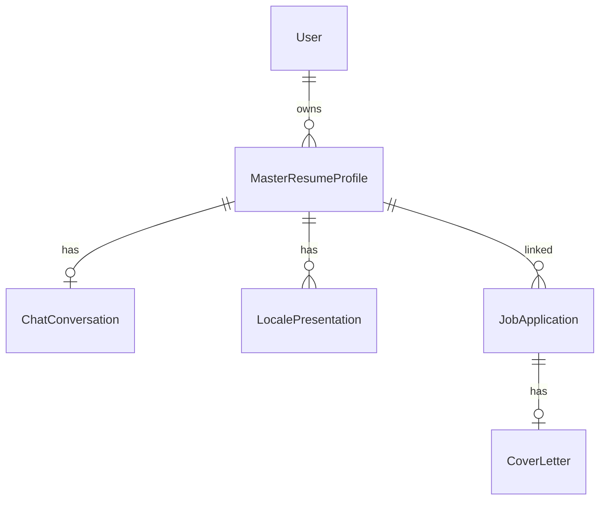

# 02 — Master resume, schema, and merge

Chapter 1 left you at “the master resume is sacred.” Here we open that JSON: how Zod shapes it, why every item carries **provenance**, and how [lib/resume/merge.ts](../lib/resume/merge.ts) decides what wins when LinkedIn/AI/user collide.

## The schema is the contract

[lib/resume/schema.ts](../lib/resume/schema.ts) defines `masterResumeSchema` with sections: identity, summary, experience, education, skills, projects, certifications, references, hobbies. List items require an `id` and a `provenance`:

```4:9:lib/resume/schema.ts
export const provenanceSchema = z.enum([
  "github",
  "linkedin",
  "user",
  "ai_suggested",
]);
```

**Walkthrough — why provenance exists**

| Event | Provenance written | Later import with same company+title |
|-------|--------------------|--------------------------------------|
| LinkedIn import creates Acme role | `linkedin` | May refresh bullets if not user-locked |
| User edits title inline | `user` | **Kept** — merge skips overwriting user rows |
| Chat proposes a bullet | `ai_suggested` until Confirm | Confirm flips toward user-owned data via API |

If everything were silently “user,” re-import would either clobber edits or refuse all updates. Provenance is the cheap lock bit.

Experience also preprocesses legacy `metrics` into `bullets` so older snapshots still parse — see the `experienceItemSchema` preprocess in the same file.

## Completeness is derived, not stored as truth

`MasterResumeProfile.completeness` is JSON cached on the row, but the authoritative calculator is [lib/resume/completeness.ts](../lib/resume/completeness.ts). Chat prompts use `computeCompleteness(data).gaps` so the model asks about *real* holes (missing summary, thin experience, skills without proficiency).

Trade-off: caching completeness on write avoids recomputing on every list page; the chat path recomputes from live `data` so prompts stay honest.

## Merge: the load-bearing pure function

[lib/resume/merge.ts](../lib/resume/merge.ts) is where import + AI patches become safe.

```9:39:lib/resume/merge.ts
function mergeByKey<T extends { id: string; provenance: Provenance }>(
  existing: T[],
  incoming: T[],
  keyOf: (item: T) => string,
  preferIncomingWhen?: (a: T, b: T) => boolean,
): T[] {
  const map = new Map<string, T>();
  for (const item of existing) map.set(keyOf(item), item);
  for (const item of incoming) {
    const key = keyOf(item);
    const prev = map.get(key);
    if (!prev) {
      map.set(key, item);
      continue;
    }
    if (isUserConfirmed(prev.provenance)) continue;
    // ... merge fields, keep prev.id for stability ...
  }
  return Array.from(map.values());
}
```

Experience keys by `company|title` (lowercased), not by id — because re-imports mint new ids. Stable `prev.id` keeps logos and UI keys from thrashing.

**Concrete merge walkthrough**

Existing:

```
exp id=e1 company=Acme title=Engineer provenance=user bullets=["Shipped X"]
```

Incoming LinkedIn:

```
exp id=li9 company=Acme title=Engineer provenance=linkedin bullets=["Did Y"]
```

Steps:

1. Key both as `acme|engineer`.
2. `prev.provenance === "user"` → **continue** (skip overwrite).
3. Result still has `e1` and “Shipped X”.

Flip `prev` to `linkedin` and the incoming row can replace content while keeping `e1`’s id when the merge path copies `id: prev.id`.

Skills use **name** union ([`unionSkills`](../lib/resume/merge.ts)) so “TypeScript” from GitHub and chat collapse to one row; user-confirmed proficiency wins.

## Patches vs full documents

AI chat does **not** send RFC 6902 by preference. The prompt asks for a partial resume object in a `json-patch` fence. Models sometimes emit ops arrays anyway — [normalizeResumePatch](../lib/ai/enrich-chat.ts) converts `/skills` replace ops into `{ skills: [...] }` so merge still works. Chapter 3 shows extraction; chapter 5 shows the unit tests.

| Patch style | Chosen? | Why |
|-------------|---------|-----|
| Partial section objects | Yes | Natural for merge + Zod |
| RFC 6902 ops | Accepted via normalize | Models emit them; don’t crash |
| Full resume replace | Avoided for chat | Easy to wipe user data |

## Optimistic concurrency

Profiles carry `version`. Confirm sends the version the UI last saw; the API bumps it on write. Two tabs fighting each other should fail the stale writer instead of silently clobbering — look for `version` in `PATCH` bodies from [patch-confirm.tsx](../components/chat/patch-confirm.tsx).



Caption: applications hang off profiles; cover letters hang off applications — master resume stays the hub.

Next: the enrichment chat pipe — prompts, streaming, fence extraction, and the Confirm button that finally calls merge.

## Try it out

Try each step yourself first — expand the solution only when stuck.

1. Run the merge unit tests and read one failure message if you break `isUserConfirmed` temporarily (then revert).

   <details>
   <summary><b>Solution</b></summary>

   ```bash
   npm test -- tests/unit/merge.test.ts
   ```

   Expect pass. If you flip `isUserConfirmed` to always `false`, user rows become overwritable — that is exactly what provenance prevents. Restore the function before committing.
   </details>

2. Find `applyConfirmedPatch` (or similar) in [lib/resume/merge.ts](../lib/resume/merge.ts) and note which provenance it assigns after confirm.

   <details>
   <summary><b>Solution</b></summary>

   ```bash
   rg "confirm|ai_suggested|provenance" lib/resume/merge.ts
   ```

   Confirmed AI content is treated as user-owned thereafter so the next import cannot stomp it. That is the product promise behind the Confirm button.
   </details>

3. Parse a minimal invalid resume with Zod in a one-off script using the project’s `tsx`.

   <details>
   <summary><b>Solution</b></summary>

   ```bash
   npx tsx -e '
   import { masterResumeSchema } from "./lib/resume/schema.ts";
   console.log(masterResumeSchema.safeParse({ identity: {}, experience: [{ id: "x" }] }).success);
   '
   ```

   Expect `false` — experience needs company, title, provenance. Zod at the boundary is why garbage LLM JSON should not hit Prisma unchecked (callers still must `safeParse`).
   </details>

4. Open a resume in the UI, edit one experience bullet, save, then re-open Prisma Studio and inspect `data` JSON for that bullet’s provenance.

   <details>
   <summary><b>Solution</b></summary>

   ```bash
   npx prisma studio
   ```

   Find `MasterResumeProfile` → `data` → experience entry → `"provenance": "user"`. Inline edits are first-class writes, not “AI suggestions.”
   </details>
