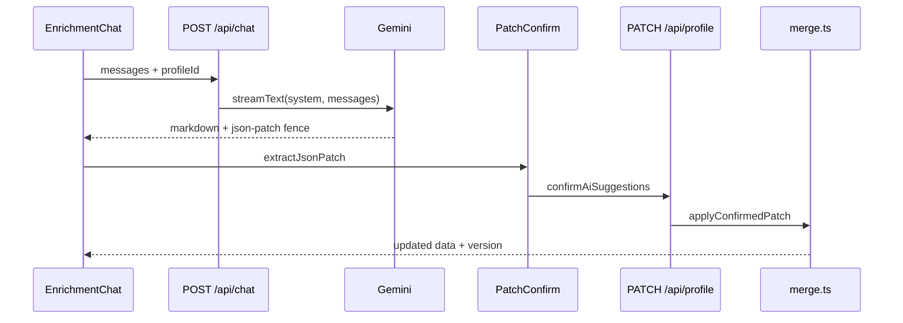

# 03 — Enrichment chat: propose, stream, confirm

The workspace left pane is not a generic chatbot. It is a **gap-aware coach** that streams markdown, embeds a machine-readable patch, and refuses to mutate the master resume until you click Confirm. This chapter follows one message from [EnrichmentChat](../components/chat/enrichment-chat.tsx) through [app/api/chat/route.ts](../app/api/chat/route.ts) and back.

## Client: `useChat` + local fence parse

[components/chat/enrichment-chat.tsx](../components/chat/enrichment-chat.tsx) uses Vercel AI SDK `useChat` pointed at `/api/chat`, body `{ profileId, applicationId? }`. After each assistant turn it runs `extractJsonPatch` on the text. If a patch exists, [PatchConfirm](../components/chat/patch-confirm.tsx) renders.

Clear chat (`DELETE /api/chat?profileId=…`) empties `ChatConversation.messages` so old “paste your JD” threads do not poison new coaching (especially once job context exists — chapter 4).

## Server: auth → load profile → build system prompt → stream

```21:41:app/api/chat/route.ts
export async function POST(req: Request) {
  const session = await auth();
  if (!session?.user?.id) return unauthorized();
  // ...
  const profile = await getOwnedProfile(session.user.id, profileId);
  if (!profile) return notFound("Resume not found");
```

No profile ownership → 404. Then completeness gaps + optional **job context** feed [buildEnrichmentSystemPrompt](../lib/ai/enrich-chat.ts).

When `applicationId` is present and the application’s `linkedResumeId` matches this profile, the route calls `ensureJobPostingParsed` and injects the cached posting. The prompt **forbids** asking the user to paste a JD when that block exists — models still sometimes ignore soft wording; the CRITICAL block is there for a reason.

**No LLM key:** if `!hasLlmKey()`, the chat UI shows that AI features are unavailable and input is disabled. The API returns the same short message instead of a scripted offline coach.

With a key, `streamText({ model: getChatModel(), system, messages })` streams tokens; `onFinish` appends the assistant message via [saveConversationMessages](../lib/ai/conversation.ts).

## The patch fence contract

The system prompt demands a fenced block labeled `json-patch` containing a **partial resume object**, not an ops array. Real extraction code:

```149:157:lib/ai/enrich-chat.ts
export function extractJsonPatch(text: string): Record<string, unknown> | null {
  const match = text.match(/```json-patch\s*([\s\S]*?)```/i);
  if (!match) return null;
  try {
    return normalizeResumePatch(JSON.parse(match[1]));
  } catch {
    return null;
  }
}
```

`normalizeResumePatch` then either passes objects through or folds RFC 6902 `replace`/`add` ops whose path starts with `/section` into `{ section: value }`.

**Walkthrough — two model outputs, one pipeline**

| Model emits | After `normalizeResumePatch` | UI |
|-------------|------------------------------|----|
| Partial `{ "skills": [...] }` in fence | `{ skills: [...] }` | Confirm shows skills |
| `[{"op":"replace","path":"/skills","value":[...]}]` | `{ skills: value }` | Same Confirm |
| Prose only, no fence | `null` | No Confirm bar |
| Fence with invalid JSON | `null` (catch) | No Confirm — model wasted tokens |

That normalize step is why [tests/unit/normalize-patch.test.ts](../tests/unit/normalize-patch.test.ts) exists — LLMs are sloppy; the product must not be.

## Persistence: conversation is not the resume

[lib/ai/conversation.ts](../lib/ai/conversation.ts) upserts a `ChatConversation` keyed by `profileId` and stores the message array as JSON. Chat history can be wiped without touching `MasterResumeProfile.data`. That is intentional: coaching transcripts are disposable; the resume is not.

**Gotcha — application-scoped coaching shares resume chat history**

When you open the same linked resume from Application → Resume, you still use the profile’s single `ChatConversation`. Job context is injected per *request* via `applicationId`, but prior messages remain. Clear chat when switching from “build my life story” to “tailor for Semeia.”

## Confirm writes through merge

```30:42:components/chat/patch-confirm.tsx
      const res = await fetch("/api/profile", {
        method: "PATCH",
        headers: { "Content-Type": "application/json" },
        body: JSON.stringify({
          profileId,
          version,
          patch,
          confirmAiSuggestions: true,
        }),
      });
```

Server applies the patch with the merge rules from chapter 2, bumps `version`, may kick locale delta retranslate, and returns the new profile. Reject simply dismisses the UI (and can strip fences from stored messages on cover-letter chat; resume reject is local dismiss unless you clear history).



Caption: two HTTP round-trips — propose vs commit. Never collapse them if you care about user agency.

| Design | Chosen | Alternative |
|--------|--------|-------------|
| Tool/function calling for patches | Markdown fences | Tools are stricter but harder to show in chat history |
| Stream tokens to UI | Yes (`toDataStreamResponse`) | Wait for full completion — worse UX |
| Auto-apply on stream end | No | Faster demos, dangerous for resumes |

Next we leave the solo workspace and enter **applications**: cached job postings and the cover-letter twin of this chat.

## Try it out

Try each step yourself first — expand the solution only when stuck.

1. Run the normalize-patch tests:

   ```bash
   npm test -- tests/unit/normalize-patch.test.ts
   ```

   <details>
   <summary><b>Solution</b></summary>

   Both “partial object” and “RFC 6902 ops” cases should pass. That is the fence contract encoded as tests.
   </details>

2. With the app running, open a resume workspace and send “add TypeScript as an everyday skill”. Inspect the assistant message for a `json-patch` fence.

   ```bash
   npm run dev
   ```

   Then open `http://localhost:3000`, sign in, open a resume, and use the chat. Watch `POST /api/chat` in DevTools — the streamed text should include a `` ```json-patch `` fence.

   <details>
   <summary><b>Solution</b></summary>

   Confirm appears only after `extractJsonPatch` succeeds. Without `GOOGLE_GENERATIVE_AI_API_KEY`, the chat panel shows that AI is unavailable and Send is disabled.
   </details>

3. Click Confirm on a patch and verify `MasterResumeProfile.version` increments:

   ```bash
   npx prisma studio
   ```

   <details>
   <summary><b>Solution</b></summary>

   Note `version` before Confirm, apply, refresh — version should be `n+1`. Stale clients sending old `version` should fail the PATCH (optimistic concurrency).
   </details>

4. Clear chat from the UI header, then confirm `ChatConversation.messages` is `[]` in the DB (same Studio session as step 3):

   ```bash
   npx prisma studio
   ```

   <details>
   <summary><b>Solution</b></summary>

   Clear chat → `DELETE /api/chat?profileId=…` → Studio shows empty messages array. Starting fresh matters once job context is injected; old turns asking for a JD will otherwise keep steering the model.
   </details>
