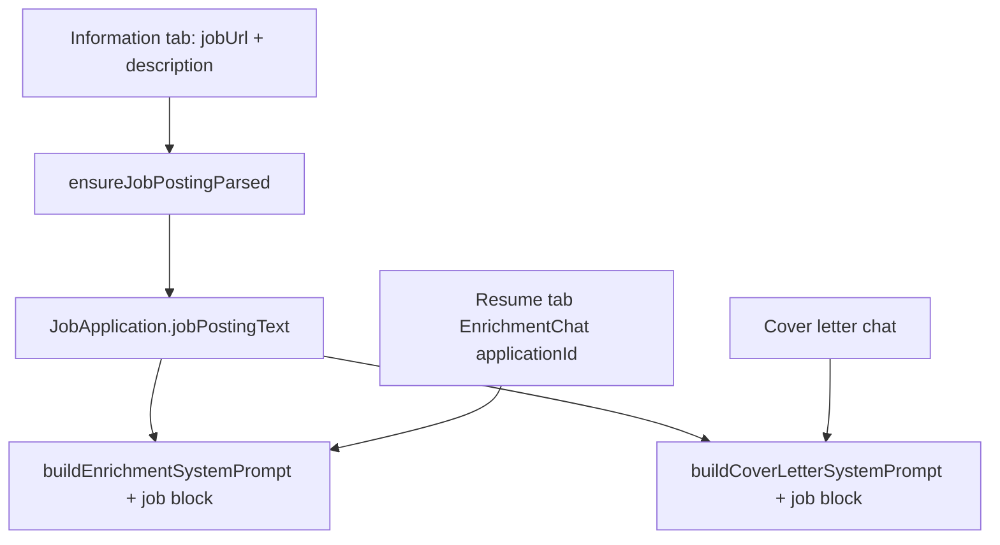

# 04 — Applications, job postings, and cover letters

Resumes alone do not ship job applications. Feature specs `003` and `004` added a tracker and a per-application cover-letter workspace that **reuses** the chat/confirm pattern from chapter 3 — with a different prompt and a markdown body instead of master-resume JSON.

## Data shape

From [prisma/schema.prisma](../prisma/schema.prisma):

- `JobApplication` — title, company, status, optional `jobUrl`, optional `linkedResumeId`, plus **cached** `jobPostingText` / `jobPostingParsedUrl` / `jobPostingParsedAt`.
- `CoverLetter` — 1:1 with application: `content`, `subject`, template, colors, identity override, recipient fields, locales.
- `CoverLetterConversation` — chat messages (parallel to resume `ChatConversation`).

Deleting an application cascades cover letter + conversation; the linked resume **survives** (`onDelete: SetNull` on the resume FK).

## Parse the job URL once

[lib/applications/job-posting.ts](../lib/applications/job-posting.ts) is deliberately paranoid:

1. Normalize URL — only `http`/`https`; block localhost, private IPv4, `.internal` (SSRF).
2. Fetch HTML with timeout + size cap (`MAX_HTML_BYTES`, `FETCH_TIMEOUT_MS`).
3. Strip tags to text (`htmlToText`).
4. If Gemini is configured, `generateObject` into `extractedJobSchema`; else store truncated raw text.
5. Persist on the application when `jobPostingParsedUrl` matches current URL; otherwise re-parse.

Why not scrape on every chat turn? Cost, latency, and flaky job boards. Cache-by-URL is the boring correct answer.

**Walkthrough — cache hit vs miss**

| State | `ensureJobPostingParsed` |
|-------|--------------------------|
| No `jobUrl` | No-op |
| Text present and `parsedUrl === jobUrl` | Return cached text, `parsed: false` |
| URL changed (PATCH cleared cache) | Fetch + AI extract, write row |
| Fetch fails | Leave cache empty so a later attempt retries |

UI: Information tab under Job posting URL ([application-form.tsx](../components/applications/application-form.tsx)) shows status + “View parsed posting” + Parse/Re-parse. API: [job-posting/route.ts](../app/api/applications/[applicationId]/job-posting/route.ts).

Cover-letter chat and (when `applicationId` is passed) resume chat both call `ensureJobPostingParsed` before building prompts.

**SSRF table (what we refuse)**

| URL | Allowed? |
|-----|----------|
| `https://boards.greenhouse.io/...` | Yes |
| `http://127.0.0.1:8080/secrets` | No |
| `http://169.254.169.254/latest/meta-data` | No |
| `file:///etc/passwd` | No (scheme) |

## Cover letter chat ≠ resume chat

| | Resume enrichment | Cover letter |
|--|-------------------|--------------|
| Prompt | [lib/ai/enrich-chat.ts](../lib/ai/enrich-chat.ts) | [lib/ai/cover-letter-chat.ts](../lib/ai/cover-letter-chat.ts) |
| Artifact | Partial resume JSON | Letter **body** markdown (`cover-letter-suggestion` / `cover-letter-patch`) |
| Apply | `PATCH /api/profile` + merge | `.../apply-suggestion` with confirm |
| Context | Profile + gaps (+ job if application) | Application + resume snippet + job posting |

Identity (name, photo, recipient block) lives in form fields / template chrome — the model is told **not** to reinvent letterhead in the body. That split keeps print/PDF layout stable while chat rewrites paragraphs.

Cover letter prompts also switch modes: empty body → full `cover-letter-suggestion` fence; existing body → prefer small `cover-letter-patch` FIND/REPLACE blocks so you do not nuke a polished draft when asking to “make the second paragraph sharper.”

**Walkthrough — FIND must be exact**

| Current body contains | FIND from model | Apply result |
|-----------------------|-----------------|--------------|
| `I am excited about…` | Same string | Replace succeeds |
| Same text with different newline | Slightly different FIND | Apply fails — UI shows error |

Exact substring matching is brittle on purpose: it prevents “creative” patches from rewriting the wrong paragraph.

Caption: one cache, two consumers — parse cost amortized across resume tailor + cover draft.

## Application detail tabs

[application-detail-client.tsx](../app/(app)/applications/[applicationId]/application-detail-client.tsx) hosts Information / Resume / Cover Letter. Resume embeds [WorkspaceClient](../app/(app)/workspace/workspace-client.tsx) with `embedded` + `applicationId` so enrichment chat receives job context. Chrome (title, tabs) is `print:hidden` so Export PDF from the resume tab does not print the tracker UI.

## Print still surprises people

Cover letter PDF uses [lib/cover-letter/print.ts](../lib/cover-letter/print.ts): temporarily moves `.cover-letter-print-root` onto `document.body`, sets `html.printing-cover-letter`, then `window.print()`. Nested dialogs/portals otherwise print blank pages. Resume print had the opposite bug: clipped A4 stacks that Chrome ignores in print — continuous `.a4-preview-print` + `break-inside` on `[data-resume-block]` (see [components/preview/a4-preview-shell.tsx](../components/preview/a4-preview-shell.tsx) and [app/globals.css](../app/globals.css)).

| Export path | Mechanism | Trade-off |
|-------------|-----------|-----------|
| User “PDF” | Browser print WYSIWYG | Pixel-faithful to preview; flaky print CSS |
| react-pdf | Structured document | Good for stored shares; layout drift risk |
| docx | `docx` package | Editable in Word; not identical to A4 CSS |

Next: how the **unit suite** locks the pure functions you just leaned on — and what the project deliberately does *not* test.

## Try it out

Try each step yourself first — expand the solution only when stuck.

1. On an application with a public job URL, click **Parse posting** and expand **View parsed posting**.

   

   
<b>Solution</b>

   Information tab → Job posting URL saved → Parse. Network: `POST /api/applications/:id/job-posting`. Prisma: `jobPostingText` and `jobPostingParsedAt` populated. Re-parse with force clears then refetches.
   

2. Open Cover Letter chat, ask for a draft, and confirm the assistant does **not** invent a full address header if identity fields already exist in the preview.

   

   
<b>Solution</b>

   Body should start near a salutation. If the model dumps letterhead anyway, reject and refine — the system prompt rules are in `buildCoverLetterSystemPrompt`. Apply only via Confirm so bad fences never silently overwrite.
   

3. Change `jobUrl` on the application, save, and verify parse cache cleared (`jobPostingText` null) until the next parse/chat.

   

   
<b>Solution</b>

   [app/api/applications/[applicationId]/route.ts](../app/api/applications/[applicationId]/route.ts) nulls posting fields when URL changes. That prevents tailoring to the previous company’s JD.
   

4. From the Resume tab of an application, clear chat and ask “tailor my summary to this role” — the reply should reference posting requirements without asking you to paste them.

   

   
<b>Solution</b>

   `EnrichmentChat` sends `applicationId`; `/api/chat` injects job context. If it still asks for a JD, confirm parse status is **ready** on Information, clear chat again, and retry — stale history overrides system instructions.
   

