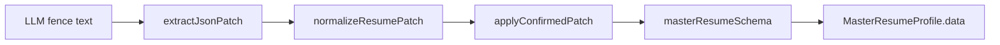

# 05 — Testing the load-bearing bits

This repo’s tests are small on purpose. There is no Playwright suite in-tree. What *is* tested are the pure functions where a bug silently corrupts resumes or accepts garbage LLM output. That choice matches Spec Kit’s “confirm before write” product rule: if merge and patch normalize are wrong, Confirm becomes a foot-gun.

## How to run

Node **20+**, dependencies installed (`npm install`). From the repo root:

```bash
npm test              # vitest run — CI style
npm run test:watch    # interactive
```

Config: [vitest.config.ts](../vitest.config.ts) — `environment: "node"`, `@` → repo root. No jsdom, no Next request fixtures.

## What is covered

| File | Protects |
|------|----------|
| [tests/unit/merge.test.ts](../tests/unit/merge.test.ts) | Import/AI merge vs user provenance ([lib/resume/merge.ts](../lib/resume/merge.ts)) |
| [tests/unit/normalize-patch.test.ts](../tests/unit/normalize-patch.test.ts) | Fence JSON + RFC 6902 → section objects ([lib/ai/enrich-chat.ts](../lib/ai/enrich-chat.ts)) |
| [tests/unit/translate-text.test.ts](../tests/unit/translate-text.test.ts) | Delta extract/apply for locales ([lib/ai/translate.ts](../lib/ai/translate.ts)) |
| [tests/unit/skill-categories.test.ts](../tests/unit/skill-categories.test.ts) | EN/FR/JA category canonicalization ([lib/resume/skill-categories.ts](../lib/resume/skill-categories.ts)) |

Example from normalize tests — the exact failure mode chapter 3 described:

```22:39:tests/unit/normalize-patch.test.ts
  it("converts RFC 6902 replace ops into section objects", () => {
    const ops = [
      {
        op: "replace",
        path: "/skills",
        value: [/* skill_1 TypeScript */],
      },
    ];
    expect(normalizeResumePatch(ops)).toEqual({
      skills: ops[0].value,
    });
  });
```

## What makes testing easy here

- **Pure functions** at the core: merge, normalize, translate delta, skill categories take plain objects in/out.
- **Zod schemas** give fixtures a single import (`masterResumeSchema`) instead of hand-rolled factories everywhere.
- **No DB in unit tests** — you can run `npm test` on a laptop without Docker if you only care about these files (CI should still migrate for integration, but these tests do not query Prisma).

## What is deliberately not tested (yet)

| Gap | Why it’s hard / deferred |
|-----|---------------------------|
| `POST /api/chat` streaming | Needs Auth.js session + Gemini or deep mocks |
| Prisma ownership queries | Needs test DB + seeded users |
| Browser print CSS | Visual; flake-prone in CI |
| Full App Router pages | Better as e2e later |

Trade-off table:

| Strategy | This repo | When to invest |
|----------|-----------|----------------|
| Unit-test pure domain | Yes | Always — cheap |
| API route integration | Sparse | When auth bugs dominate |
| E2E browser | Absent | Before public launch polish |

**Walkthrough — a merge regression without tests**

1. Someone “simplifies” merge by always preferring incoming.
2. User-confirmed Acme bullets get replaced on LinkedIn refresh.
3. No unit test fails if they never ran `merge.test.ts`.
4. Product trust evaporates.

The suite exists to make step 3 loud.



Caption: every arrow that is a pure function has (or deserves) a unit test; the DB write is the seam.

Next: how this code becomes a real Vercel deployment — env vars, Neon, and why `build` runs migrations.

## Try it out

Try each step yourself first — expand the solution only when stuck.

1. Run the full unit suite and note the timing.

   <details>
   <summary><b>Solution</b></summary>

   ```bash
   npm test
   ```

   Four files should pass in well under a few seconds. That speed is the point of staying pure.
   </details>

2. Break `normalizeResumePatch` so ops arrays return `null`, re-run the normalize test, then restore.

   <details>
   <summary><b>Solution</b></summary>

   Temporarily `return null` at the top of `normalizeResumePatch` in [lib/ai/enrich-chat.ts](../lib/ai/enrich-chat.ts).

   ```bash
   npm test -- tests/unit/normalize-patch.test.ts
   ```

   Expect failure on the RFC 6902 case. Revert. You just felt why the test exists.
   </details>

3. Add a fifth assertion: `extractJsonPatch` returns null when the fence is missing.

   <details>
   <summary><b>Solution</b></summary>

   In `tests/unit/normalize-patch.test.ts`:

   ```ts
   it("returns null without a json-patch fence", () => {
     expect(extractJsonPatch("Just prose, no fence")).toBeNull();
   });
   ```

   ```bash
   npm test -- tests/unit/normalize-patch.test.ts
   ```

   Ties extraction to the Confirm UI gating behavior from chapter 3.
   </details>

4. Skim [lib/ai/translate.ts](../lib/ai/translate.ts) exports used by `translate-text.test.ts` and explain in one sentence why delta translate beats full retranslate on every keystroke.

   <details>
   <summary><b>Solution</b></summary>

   Only changed strings go to the model (`buildTranslateDelta` / `hasTranslatableDelta`), so locale presentations stay cheap and stable when you tweak one bullet. Full translate is for first-time locale creation.
   </details>
