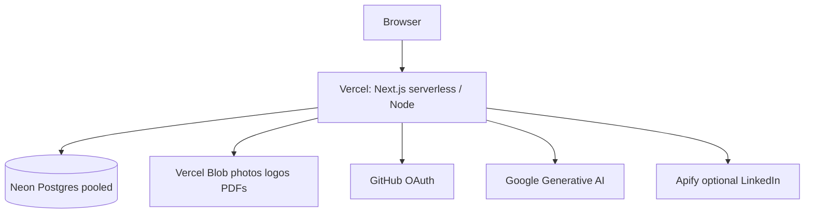

# 06 — Deploying on Vercel

Local `npm run dev` is not production. This chapter follows [deployment.md](../deployment.md): Vercel + Neon Postgres + Auth.js + Gemini, and the one build script that keeps schema and code in lockstep.

## The build command is policy

From [package.json](../package.json):

```json
"build": "prisma migrate deploy && next build"
```

Every Vercel production/preview build:

1. Applies pending SQL under [prisma/migrations/](../prisma/migrations/).
2. Builds the Next.js app.

| Approach | Chosen | Rejected |
|----------|--------|----------|
| Migrate during `build` | Yes | Drift between code and schema on deploy |
| Manual migrate SSH | No | Easy to forget; serverless has no SSH box |
| `db push` in prod | No | Unsafe for team history |

If a migration is bad, the deploy fails before serving broken code — prefer that to silent runtime Prisma errors.

`postinstall`: `prisma generate` so Client matches schema after `npm install`.

## Where it runs



Caption: no long-lived app server — route handlers and RSC run as serverless invocations; use Neon’s **pooled** `DATABASE_URL`.

Neon free tier **sleeps**. First request after idle can take hundreds of ms to seconds while compute wakes. That is cost, not a bug — documented in deployment.md.

## Env vars that matter

| Variable | Role |
|----------|------|
| `DATABASE_URL` | Hosted Postgres (not `127.0.0.1`) |
| `AUTH_SECRET` | Fresh secret for prod (`openssl rand -base64 32`) |
| `AUTH_GITHUB_ID` / `AUTH_GITHUB_SECRET` | OAuth app |
| `AUTH_URL` | Canonical site URL, no trailing slash |
| `GOOGLE_GENERATIVE_AI_API_KEY` | Gemini |
| `GEMINI_MODEL` | Optional override (`gemini-flash-latest` default in code) |
| `BLOB_READ_WRITE_TOKEN` | Photos, logos, shared PDFs |

GitHub OAuth callback in prod must match `AUTH_URL` + `/api/auth/callback/github`. Localhost callback will not work for the production Client ID unless you add both URLs on the OAuth app.

## Auth.js on the edge

[middleware.ts](../middleware.ts) uses the **edge-safe** `authConfig` (no Prisma adapter in that file). Full [lib/auth.ts](../lib/auth.ts) attaches `PrismaAdapter` for Node route handlers. Splitting config avoids bundling Prisma into Edge middleware — a common Auth.js v5 foot-gun.

**Walkthrough — request to `/workspace` in prod**

| Step | What runs | Failure mode if misconfigured |
|------|-----------|-------------------------------|
| 1 | Edge middleware `authorized` | Endless redirect loop if `AUTH_URL` wrong |
| 2 | RSC `auth()` in `(app)/layout` | Empty session → bounce to `/` |
| 3 | Page loads profiles for `session.user.id` | Wrong `AUTH_SECRET` → all sessions invalid after rotate |

Rotate `AUTH_SECRET` carefully: every existing JWT becomes garbage overnight.

## Share links and Blob

Public resumes: `/r/[token]`. Cover letters: `/cl/[token]`. Optional PDF bytes in Blob keep share downloads fast without re-rendering react-pdf on every hit. Without Blob, print-from-browser still works for the owner.

Tokens are unguessable; revoke sets status so old URLs die without deleting history rows — see share API routes under `app/api/share/`.

## Preview vs production data

Local Docker Postgres on **5433** is disposable. Neon is durable. Never point production `AUTH_GITHUB_*` at a localhost-only OAuth app and wonder why mobile users cannot sign in — add the Vercel callback URL on the GitHub OAuth app.

## Spec Kit sits beside the running app

[specs/](../specs/) (`002`, `003`, `004`) and `.cursor/skills/speckit-*` are how features are specified before code. They are not imported at runtime. When you change product behavior, update the active spec — the constitution under `.specify/memory/` is the design north star for agents and humans.

## Closing the book

You now have the spine: **owned master resume** → **confirmable AI patches** → **locale presentations** → **applications with cached JDs** → **cover letters** → **unit-tested pure core** → **Vercel+Neon deploy**. The best next read in the codebase is whichever pain you hit first: print CSS (`globals.css`), merge (`lib/resume/merge.ts`), or job posting SSRF guards (`lib/applications/job-posting.ts`).

## Try it out

Try each step yourself first — expand the solution only when stuck.

1. Read [deployment.md](../deployment.md) §2 and write down whether your mental `DATABASE_URL` should be pooled or direct for Vercel.

   <details>
   <summary><b>Solution</b></summary>

   Use Neon’s **pooled** connection string on Vercel (host often contains `-pooler`). Serverless opens many short connections; direct URLs exhaust slots.
   </details>

2. Confirm locally that `npm run build` invokes migrate (dry-run by watching logs) — only if your local DB is up.

   <details>
   <summary><b>Solution</b></summary>

   ```bash
   docker compose up -d
   npm run build
   ```

   Log lines should show Prisma migrate, then Next build. Needs valid env for Auth during build if pages call `auth()` at build time — if build fails on missing env, set placeholders in `.env.local` per README.
   </details>

3. Compare [lib/auth.config.ts](../lib/auth.config.ts) vs [lib/auth.ts](../lib/auth.ts) and list what must stay out of middleware.

   <details>
   <summary><b>Solution</b></summary>

   Prisma adapter / DB calls belong in `lib/auth.ts` (Node). Middleware imports only `authConfig` providers + JWT callbacks. That split keeps Edge bundles small and deployable.
   </details>

4. Open `.env.example` and tick which vars are required for a minimal prod deploy without LinkedIn import.

   <details>
   <summary><b>Solution</b></summary>

   Required: `DATABASE_URL`, `AUTH_SECRET`, `AUTH_GITHUB_ID`, `AUTH_GITHUB_SECRET`, `AUTH_URL`, `GOOGLE_GENERATIVE_AI_API_KEY`. Blob strongly recommended for media/shares; `APIFY_*` optional.
   </details>

5. After deploy, hit `/api/auth/signin` (or `/`) and complete GitHub OAuth once, then create a resume — verify a `User` and `MasterResumeProfile` row appear in Neon’s SQL editor.

   <details>
   <summary><b>Solution</b></summary>

   Neon console → SQL: `SELECT id, email FROM "User";` and `SELECT id, title FROM "MasterResumeProfile";`. If User exists but profile does not, you stopped before workspace create — ownership chain starts at User.
   </details>
